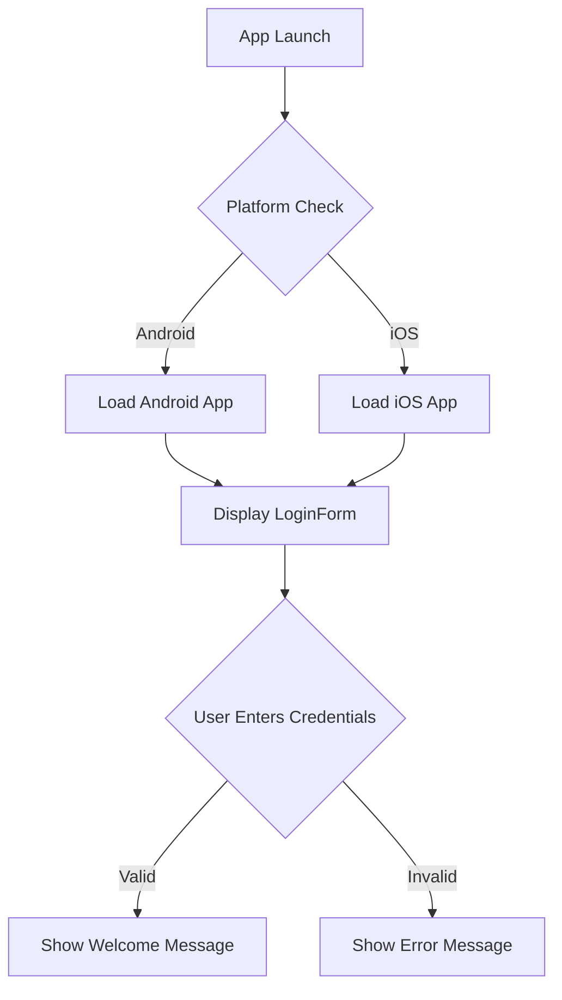

# Android/iOS KMM Project

This project is a simple demonstration of a Kotlin Multiplatform Mobile (KMM) application for both Android and iOS. It features a shared login form built with Jetpack Compose.

## ✨ Features

- Shared login form UI for both Android and iOS.
- Basic username and password validation.
- Platform-specific code for displaying the shared UI.

## 🏗️ Architecture

This project follows a standard KMM architecture, which allows for sharing code between different platforms. The project is divided into three main modules:

- **`shared` module:** Contains the common code that is shared between the Android and iOS applications. This includes business logic, data models, and, in this case, the UI, which is built using Jetpack Compose. The `commonMain` source set contains the majority of the shared code, including the `LoginForm` composable.

- **`app` module:** The Android-specific module that contains the entry point for the Android application. It depends on the `shared` module to use the common code and UI.

- **`ios` module:** The iOS-specific module that contains the entry point for the iOS application. It also depends on the `shared` module and uses a `ComposeUIViewController` to display the shared Jetpack Compose UI within a native iOS application.

## 📁 Project Structure

```
.
├── app                 # Android application module
├── build.gradle.kts
├── gradle
├── gradlew
├── gradlew.bat
├── ios                 # iOS application module
├── settings.gradle.kts
└── shared              # Shared KMM module
    ├── build.gradle.kts
    └── src
        ├── androidMain     # Android-specific code
        ├── commonMain      # Code shared between all platforms
        │   └── kotlin/com/example/shared
        │       ├── BaseClass.kt
        │       ├── LoginForm.kt
        │       └── Platform.kt
        └── iosMain         # iOS-specific code
```

## 🌊 Flow Diagram

Here is a simple flow diagram that illustrates the application's logic:



## 🚀 How to Run

### Android

1.  Open the project in Android Studio.
2.  Select the `app` run configuration.
3.  Choose an Android emulator or connect a physical device.
4.  Click the "Run" button.

### iOS

1.  Open the project in Android Studio.
2.  Select the `iosApp` run configuration.
3.  Choose an iOS simulator.
4.  Click the "Run" button.

## 📱 UI

This project uses Jetpack Compose to create the UI for both Android and iOS. Below is a placeholder for what the login screen looks like. You can replace this with actual screenshots from your application.

**Login Screen (Placeholder)**


